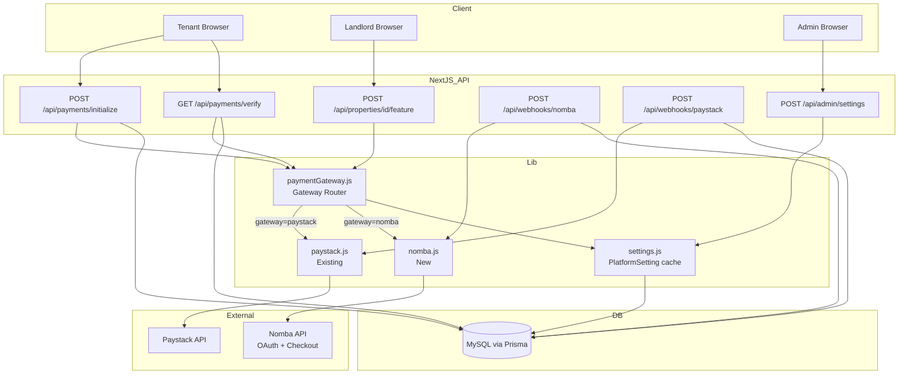

# Design Document: Nomba Payment Gateway

## Overview

This design adds Nomba as a second, switchable payment gateway alongside the existing Paystack integration. A new `Payment_Gateway_Router` module abstracts over both gateways behind a shared interface so that no calling code (payment initialization, verification, or webhook handling) needs to know which gateway is active. The active gateway is determined at runtime by reading the `ACTIVE_PAYMENT_GATEWAY` platform setting from the database, defaulting to `paystack`.

The work touches six areas:
1. Prisma schema — add `Payment.nombaRef` column
2. `src/lib/nomba.js` — new Nomba API client
3. `src/lib/paymentGateway.js` — new gateway router
4. `src/app/api/payments/initialize/route.js` — swap direct Paystack calls for the router
5. `src/app/api/payments/verify/route.js` — swap direct Paystack calls for the router
6. `src/app/api/webhooks/nomba/route.js` — new Nomba webhook handler
7. Admin settings page + seed script — expose Nomba credentials in the UI

---

## Architecture



The key design decision is that `paymentGateway.js` is the **only** file that decides which gateway to use. All upstream routes call `paymentGateway.js`; they never call `paystack.js` or `nomba.js` directly after this change.

---

## Components and Interfaces

### 1. `src/lib/nomba.js` — Nomba Client

Encapsulates all Nomba API calls. Manages its own OAuth token lifecycle using an in-process cache.

**Exported functions:**

```js
// Fetch/reuse an OAuth bearer token
async function getToken(): Promise<string>

// Create a Checkout Order and return checkout URL + orderReference
async function initializePayment({ email, amount, reference, callbackUrl, metadata }):
  Promise<{ checkoutLink: string, orderReference: string }>

// Verify a payment by orderReference
async function verifyPayment(orderReference):
  Promise<{ status: "success"|"failed", transactionId, amount, paidAt }>

// Verify an incoming Nomba webhook signature
async function validateWebhookSignature(rawBody: string, headers: Headers): Promise<boolean>
```

**Token Cache structure (module-level):**
```js
let tokenCache = { accessToken: null, expiresAt: 0 };
```

Token is considered valid if `Date.now() < expiresAt - 60_000` (60-second safety margin before expiry).

**Nomba API Endpoints Used:**
| Purpose | Method | URL |
|---|---|---|
| Issue OAuth token | POST | `https://api.nomba.com/v1/auth/token/issue` |
| Create Checkout Order | POST | `https://api.nomba.com/v1/checkout/order` |
| Verify transaction | GET | `https://api.nomba.com/v1/transactions/accounts/single?orderReference={ref}` |

**Token request body:**
```json
{
  "grant_type": "client_credentials",
  "client_id": "<NOMBA_CLIENT_ID>",
  "client_secret": "<NOMBA_CLIENT_SECRET>"
}
```
Authorization header: `Bearer <NOMBA_ACCOUNT_ID>`

**Checkout Order request body:**
```json
{
  "orderReference": "<reference>",
  "customerId": "<email>",
  "callbackUrl": "<callbackUrl>",
  "customerEmail": "<email>",
  "currency": "NGN",
  "amount": "<(amount).toFixed(2)>",
  "metadata": { ... }
}
```

**Webhook Signature Verification:**

Nomba signs webhooks using HMAC-SHA256 over a concatenated string, then Base64-encodes the result. The string to sign is:
```
event_type:requestId:merchant.userId:merchant.walletId:transaction.transactionId:transaction.type:transaction.time:transaction.responseCode:nomba-timestamp
```
Where `nomba-timestamp` comes from the `nomba-timestamp` request header, and the HMAC key is `NOMBA_WEBHOOK_SECRET`. The resulting Base64 string is compared against the `nomba-signature` request header.

---

### 2. `src/lib/paymentGateway.js` — Payment Gateway Router

Thin routing layer. Reads `ACTIVE_PAYMENT_GATEWAY` on every call so live setting changes are honored immediately.

**Exported functions:**

```js
async function initializePayment(params):
  Promise<{ authorization_url: string, reference: string }>

async function verifyPayment(reference):
  Promise<{ status: "success"|"failed", paid_at: string|null }>

function generateReference(prefix?: string): string

async function getActiveGateway(): Promise<"paystack"|"nomba">
```

**Response normalisation (Nomba → Paystack shape):**

| Paystack response field | Nomba source |
|---|---|
| `authorization_url` | `checkoutLink` |
| `reference` | `orderReference` |
| `status: "success"` | Nomba `status === "00"` or `"SUCCESS"` |
| `paid_at` | `paidAt` from Nomba verify |

---

### 3. Updated `src/app/api/payments/initialize/route.js`

Changes:
- Import `initializePayment`, `generateReference` from `paymentGateway.js` instead of `paystack.js`
- Read active gateway to determine which column to write:
  - `gateway === "nomba"` → write `nombaRef`, leave `paystackRef` null
  - `gateway === "paystack"` → write `paystackRef` as today (no change in behavior)
- `Payment.create` now conditionally sets `paystackRef` or `nombaRef`

The `callbackUrl` construction is identical for both gateways:
```
${appUrl}/tenant/payments/verify?reference=${reference}
```

The JSON response shape `{ paymentUrl, reference, rental }` is unchanged.

---

### 4. Updated `src/app/api/payments/verify/route.js`

Changes:
- Import `verifyPayment` from `paymentGateway.js` instead of `paystack.js`
- Payment lookup: `findFirst` with `OR: [{ paystackRef: reference }, { nombaRef: reference }]`
- Downstream transaction logic is **unchanged** — already gateway-agnostic

---

### 5. Updated `src/app/api/properties/[id]/feature/route.js`

Changes:
- Import `initializePayment`, `generateReference` from `paymentGateway.js` instead of `paystack.js`
- No column change needed (featured listing payments don't create a `Payment` record)

---

### 6. `src/app/api/webhooks/nomba/route.js` — Nomba Webhook Handler

Mirrors the Paystack webhook handler structure exactly.

**Event handled:** `payment_success`

**Payment lookup:** `Payment.findFirst({ where: { nombaRef: data.order.orderReference } })`

**Atomic transaction (rental payment):** Same as Paystack webhook — updates `Payment`, `Rental`, `Property`, `Escrow` records.

**Featured listing:** Reads `data.order.metadata.type === 'FEATURE_LISTING'` → updates `Property.isFeatured` and `Property.featuredUntil` exactly as the Paystack handler does.

Response contract: always `{ status: "ok" }` on success, `{ error: "..." }` on failure.

---

### 7. Admin Settings UI (`src/app/(dashboard)/admin/settings/page.js`)

A new group entry is added to `settingGroups`:
```js
{ id: 'PAYMENT_GATEWAY', label: 'Payment Gateway', icon: CreditCard }
```

New fields added to `defaultSettings`:
```js
{ key: 'ACTIVE_PAYMENT_GATEWAY', group: 'PAYMENT_GATEWAY', label: 'Active Gateway', type: 'text', description: 'paystack or nomba' },
{ key: 'NOMBA_CLIENT_ID',        group: 'PAYMENT_GATEWAY', label: 'Nomba Client ID', type: 'text' },
{ key: 'NOMBA_CLIENT_SECRET',    group: 'PAYMENT_GATEWAY', label: 'Nomba Client Secret', type: 'password' },
{ key: 'NOMBA_ACCOUNT_ID',       group: 'PAYMENT_GATEWAY', label: 'Nomba Account ID', type: 'text' },
{ key: 'NOMBA_WEBHOOK_SECRET',   group: 'PAYMENT_GATEWAY', label: 'Nomba Webhook Secret', type: 'password' },
```

No changes to the save/load mechanism — it already works generically.

---

### 8. `src/lib/settings.js` — `checkPlatformHealth` Update

When `ACTIVE_PAYMENT_GATEWAY === "nomba"`, add `NOMBA_CLIENT_ID`, `NOMBA_CLIENT_SECRET`, `NOMBA_ACCOUNT_ID` to `criticalKeys`. When value is `"paystack"` or absent, these keys are excluded.

---

## Data Models

### `Payment` model — add `nombaRef`

```prisma
model Payment {
  id          Int           @id @default(autoincrement())
  rentalId    Int           @map("rental_id")
  amount      Decimal       @db.Decimal(12, 2)
  paystackRef String?       @unique @map("paystack_ref")   // now nullable
  nombaRef    String?       @unique @map("nomba_ref")      // new column
  status      PaymentStatus @default(PENDING)
  paidAt      DateTime?     @map("paid_at")
  createdAt   DateTime      @default(now()) @map("created_at")
  rental      Rental        @relation(fields: [rentalId], references: [id])

  @@index([rentalId])
  @@map("payments")
}
```

**Migration notes:**
- `paystackRef` changes from `String @unique` (NOT NULL) to `String? @unique` (nullable) — requires a Prisma migration
- `nombaRef` is a new `String? @unique` column — added in the same migration
- Existing rows already have a `paystackRef` value so they are unaffected by making it nullable

### `PlatformSetting` rows (seed additions)

| key | group | label | type | default value |
|---|---|---|---|---|
| `ACTIVE_PAYMENT_GATEWAY` | `PAYMENT_GATEWAY` | Active Gateway | string | `paystack` |
| `NOMBA_CLIENT_ID` | `PAYMENT_GATEWAY` | Nomba Client ID | string | _(empty)_ |
| `NOMBA_CLIENT_SECRET` | `PAYMENT_GATEWAY` | Nomba Client Secret | password | _(empty)_ |
| `NOMBA_ACCOUNT_ID` | `PAYMENT_GATEWAY` | Nomba Account ID | string | _(empty)_ |
| `NOMBA_WEBHOOK_SECRET` | `PAYMENT_GATEWAY` | Nomba Webhook Secret | password | _(empty)_ |

---

## Correctness Properties

*A property is a characteristic or behavior that should hold true across all valid executions of a system — essentially, a formal statement about what the system should do. Properties serve as the bridge between human-readable specifications and machine-verifiable correctness guarantees.*

### Property 1: Gateway Router defaults to Paystack

*For any* call to `Payment_Gateway_Router` where `ACTIVE_PAYMENT_GATEWAY` is absent, empty, or any value other than `"nomba"`, the router SHALL delegate to the Paystack client and SHALL NOT invoke any Nomba function.

**Validates: Requirements 1.4, 3.4**

---

### Property 2: Gateway Router response shape is stable

*For any* valid payment initialization call through the router regardless of which gateway is active, the returned object SHALL contain both `authorization_url` (a non-empty string) and `reference` (a non-empty string).

**Validates: Requirements 3.2, 4.4**

---

### Property 3: Nomba amount encoding

*For any* monetary amount (a positive number), the Nomba client's checkout request SHALL send that amount as a string equal to `(amount).toFixed(2)` — i.e., always two decimal places, denominated in Naira.

**Validates: Requirements 2.5**

---

### Property 4: Token cache avoids redundant fetches

*For any* sequence of Nomba API calls made within a single process where the cached token has not yet expired, the `getToken` function SHALL return the same `accessToken` without issuing a new HTTP request to the token endpoint.

**Validates: Requirements 2.2, 2.3**

---

### Property 5: Payment column mutual exclusivity

*For any* `Payment` record created by the system, exactly one of `paystackRef` or `nombaRef` SHALL be non-null, and the other SHALL be null — never both set, never both null.

**Validates: Requirements 4.2, 8.3**

---

### Property 6: Verify route lookup is gateway-agnostic

*For any* payment reference (whether a Paystack reference or a Nomba orderReference), the verify route's database lookup SHALL find the corresponding `Payment` record regardless of which column stores it.

**Validates: Requirements 5.2**

---

### Property 7: Webhook signature rejection

*For any* incoming webhook request where the HMAC-SHA256 signature does not match the expected value computed from `NOMBA_WEBHOOK_SECRET`, the `Nomba_Webhook_Handler` SHALL return HTTP 401 and SHALL NOT modify any database record.

**Validates: Requirements 6.2, 6.3**

---

### Property 8: Idempotent webhook processing

*For any* `payment_success` Nomba webhook event whose `orderReference` matches a `Payment` already in `SUCCESS` status, the handler SHALL return HTTP 200 without re-executing the state transition transaction.

**Validates: Requirements 6.4, 6.5**

---

## Error Handling

| Scenario | Behavior |
|---|---|
| Nomba token endpoint returns non-`"00"` code | `getToken` throws `Error` with Nomba `description`; calling route returns HTTP 500 |
| Nomba checkout endpoint fails | `initializePayment` throws; initialize route returns HTTP 500 `{ error: "Failed to initialize payment" }` |
| Nomba verify endpoint returns non-success status | `verifyPayment` returns `{ status: "failed" }`; verify route marks `Payment.status = FAILED`, does not touch Rental/Property/Escrow |
| `Payment_Gateway_Router.verifyPayment` throws | Verify route catches, returns HTTP 500 `{ error: "Failed to verify payment" }` |
| Nomba webhook: invalid signature | HTTP 401, no DB writes |
| Nomba webhook: unexpected exception | HTTP 500 `{ error: "Webhook processing failed" }`, error logged |
| `ACTIVE_PAYMENT_GATEWAY` not set | Router defaults to `"paystack"`, logs a debug message |
| DB transaction failure in webhook | Exception propagates to outer catch; HTTP 500 returned; Nomba will retry (idempotent check guards against double-processing on retry) |

---

## Testing Strategy

### Unit Tests

Test the following functions in isolation using mocks for `fetch`, `prisma`, and `getSetting`:

- `nomba.getToken()` — happy path, expired token refresh, API error propagation
- `nomba.initializePayment()` — correct request body shape, amount encoding, error handling
- `nomba.verifyPayment()` — success mapping, failure mapping
- `nomba.validateWebhookSignature()` — valid signature, tampered body, missing header
- `paymentGateway.initializePayment()` — routes to Paystack when selector is `"paystack"`, routes to Nomba when `"nomba"`, defaults to Paystack for unknown values
- `paymentGateway.verifyPayment()` — response normalisation for both gateways

### Property-Based Tests

Use a property-based testing library (e.g., **fast-check**) with minimum **100 iterations** per property. Each test should reference its design property number in a comment.

Properties to implement as property tests:
- **Property 2**: Generate arbitrary amount values; assert router always returns `{ authorization_url, reference }` shape
- **Property 3**: Generate arbitrary positive amounts; assert `toFixed(2)` encoding matches expected string
- **Property 5**: For any gateway selection, assert only one ref column is set after `initialize`
- **Property 8**: Generate arbitrary webhook payloads for already-SUCCESS payments; assert no DB update is triggered

### Integration Tests

Manual or scripted integration tests against the Nomba sandbox environment:
- Complete payment flow: initialize → Nomba hosted checkout → callback → verify
- Webhook delivery: trigger a test payment_success from Nomba dashboard → confirm DB state
- Gateway switch: change `ACTIVE_PAYMENT_GATEWAY` in admin UI, make a payment, confirm correct ref column populated

### Admin UI Tests

- Verify `PAYMENT_GATEWAY` group appears in settings sidebar
- Verify all five fields render and save correctly
- Verify health check badge reflects missing Nomba keys when gateway is set to `nomba`
